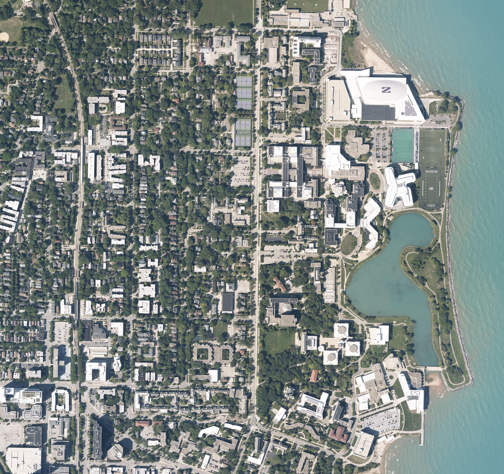
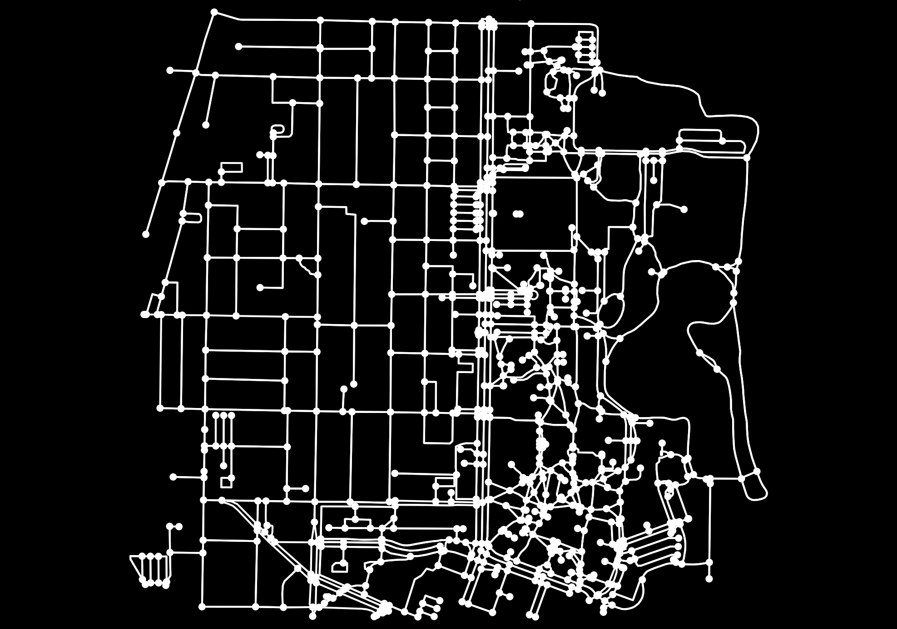
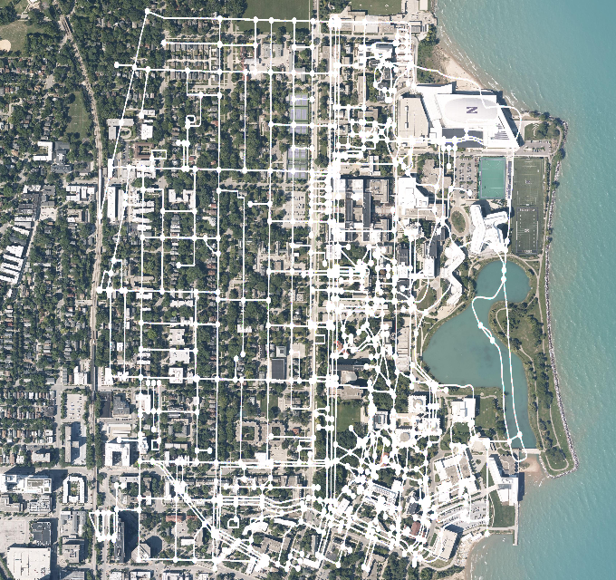
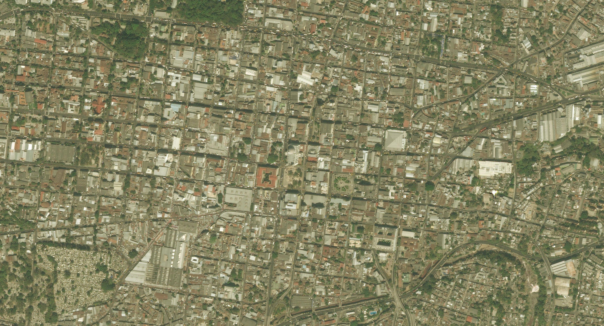
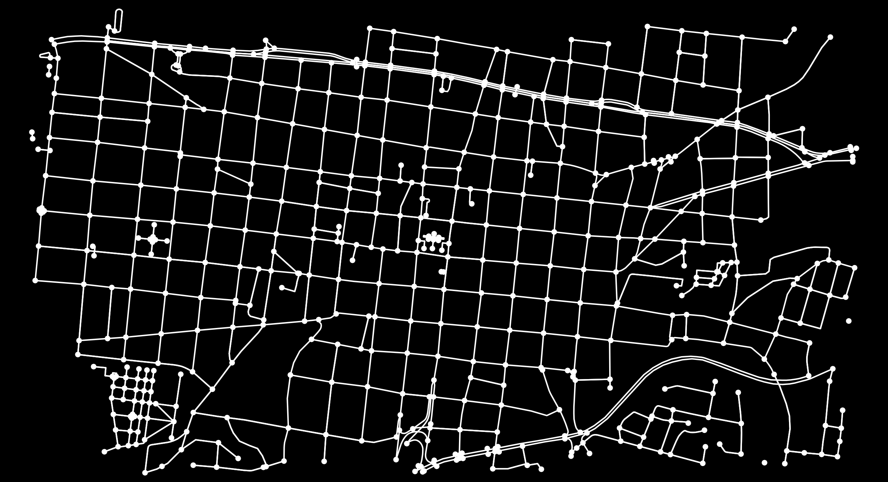
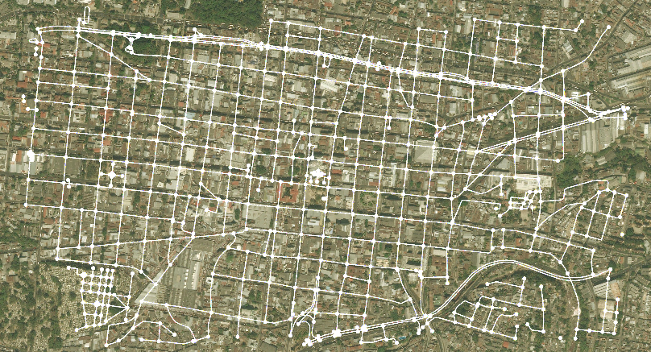

# Aerial Imagery and OpenStreetMap Retrieval
### Authors: Christopher Tsai, Anuj Karnik
Third assignment for EE 495: Geospatial Vision and Visualization, Northwestern University, Spring 2020.

## Tasks
- Write a program using Bing maps tile system to automatically download aerial imagery (maximum resolution available) given a lat/lon bounding box (for example, [min_lat, max_lat, min_lon, max_lon]). 
- Use OpenStreetMap (OSM) API to retrieve road network/map.
- Visualize the map, and then overlay the map on the satellite image.

## Dependencies
- PIL 
- OSMnx
- OpenCV

## Results
### Northwestern University Campus
Aerial image:

OSM data:

Overlayed image:

### Interesting Location (San Salvador, El Salvador)
Aerial image:

OSM data:

Overlayed image:

## Problems and Findings
- Overlay doesn’t exactly match the roads.
  - It seems OSM data is a compressed to the middle.
  - This might be because the OSM data creates a lot of blank space on the sides.
- Aerial image for `levelOfDetail` of 18 has good enough quality, past that the code takes longer to run.
- Work for the future might include using different colors for different OSM edges and nodes as well as including landmark labels (acquired from OSM data).
